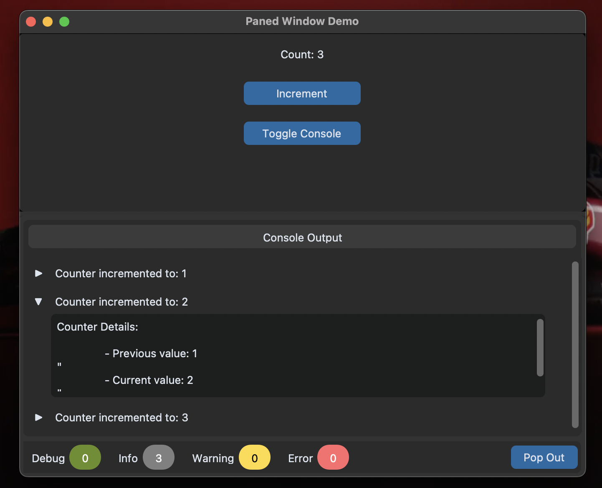
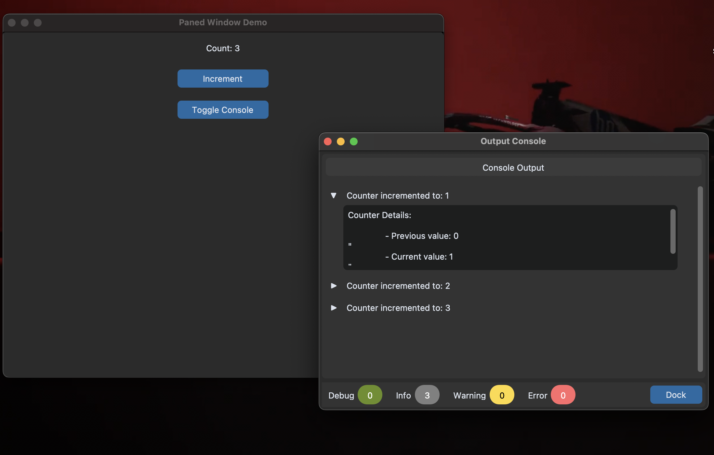

# CustomTkinter Tools

A collection of custom tools and widgets built with CustomTkinter, featuring a demo of a paned window implementation with an output console.



## Features

- Vertical paned window layout
- Collapsible output console
- Counter demonstration
- Console pop-out functionality
- Detailed logging system

### Output Console


The output console provides detailed logging information and can be toggled on/off.

### Pop-out Console



The console can be popped out into a separate window for better visibility.

## Requirements

- Python 3.x
- CustomTkinter
- tkinter (usually comes with Python)

## Installation

1. Clone the repository:

````bash
git clone https://github.com/saumyakr1232/custom_tkinter_tools.git

2. Install the required dependencies:
```bash
pip install -r requirements.txt
````

## Usage

Run the demo application:

```bash
python paned_window_demo.py
```

The demo includes:

- A counter with increment functionality
- Toggle-able console
- Pop-out console feature
- Logging system integration

## License

This project is licensed under the MIT License - see the [LICENSE](LICENSE) file for details.
